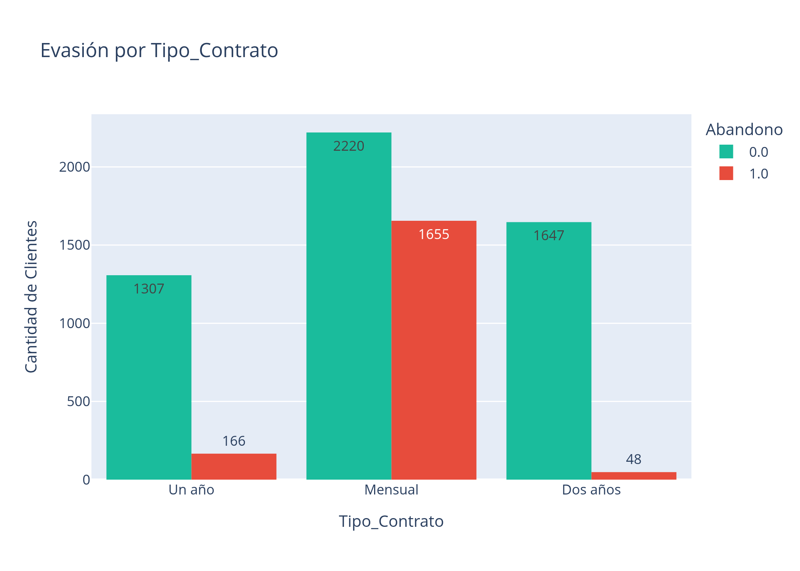
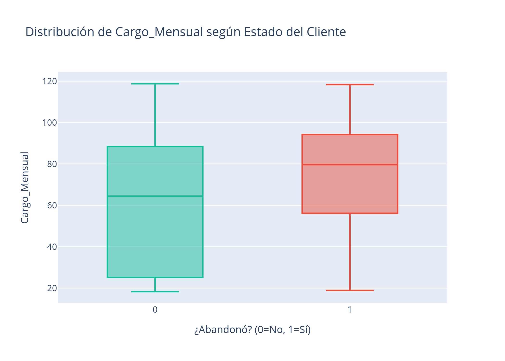
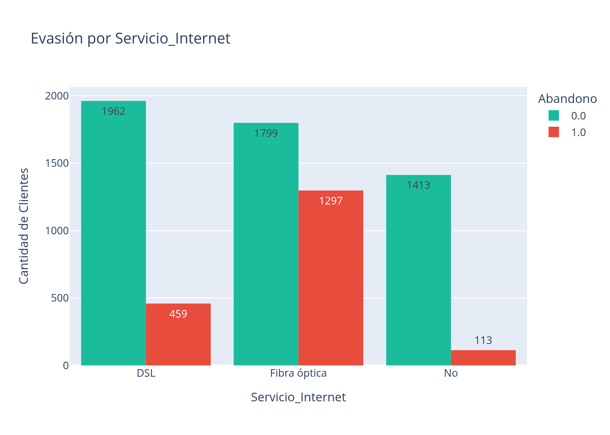
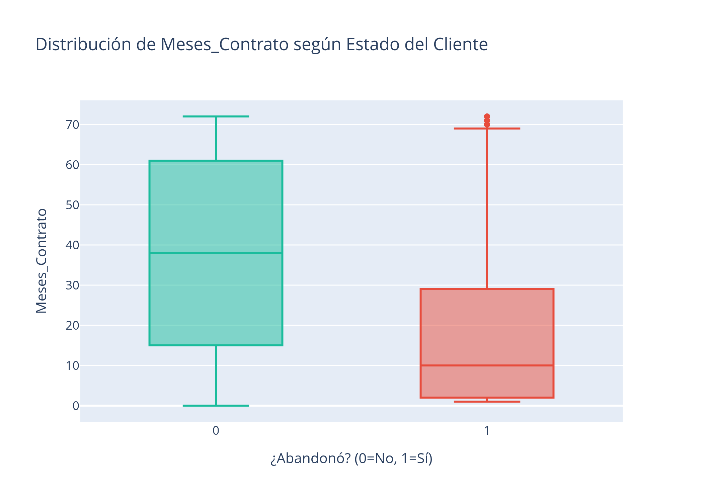

# 📡 Telecom X - Análisis de Evasión de Clientes (Churn)

## **📋 Descripción del Proyecto**

Este proyecto tiene como objetivo analizar las causas de la pérdida de clientes (**Churn**) en la empresa **Telecom X**.  
A través de un análisis de datos exhaustivo, se identifican patrones de comportamiento, perfiles de riesgo y oportunidades estratégicas para mejorar la retención de clientes.

El análisis cubre todo el flujo de trabajo típico de **Data Science**, desde la extracción de datos crudos hasta la generación de *insights* visuales y estadísticos.

---

## **📂 Estructura del Proyecto**

El proyecto sigue la estructura estándar de **Cookiecutter Data Science**, adaptada a los notebooks desarrollados:

```text
Telecom/
├── data/
│   ├── raw/        # Datos crudos (JSON original de la API)
│   ├── processed/  # Datos limpios y transformados (CSV final)
│   └── external/   # Datos de fuentes externas (no utilizado)
│
├── notebooks/      # Jupyter Notebooks numerados por etapa
│   ├── 1.0-carga-datos-json.ipynb
│   ├── 2.0-analisis-exploratorio.ipynb
│   ├── 3.0-analisis-descriptivo.ipynb
│   └── 4.0-analisis-correlacion.ipynb
│
├── reports/        # Reportes generados
│   ├── Informe Ejecutivo_ Análisis de Evasión (Churn) - Telecom X.pdf
│   └── figures/    # Gráficos exportados (PNG, HTML)
│
├── requirements.txt   # Dependencias del proyecto
└── README.md          # Documentación del proyecto
```

## **🛠 Instalación y Requisitos**

**Requisitos:**

Python 3.9 o superior

1. Clonar el repositorio

```bash
git clone https://github.com/LordAguaKate/Telecom.git
cd Telecom
```

2. Crear un entorno virtual (recomendado)
   
```bash
python3 -m venv .venv
source .venv/bin/activate   # Linux / Mac
# En Windows:
# .venv\Scripts\activate
```

3. Instalar dependencias

```bash
pip install -r requirements.txt
```

Principales librerías utilizadas:

* pandas

* numpy

* plotly

* jupyter

## **🚀 Guía de Ejecución**

El análisis es secuencial. Se recomienda ejecutar los notebooks en el siguiente orden:

1. **1.0-carga-datos-json.ipynb**

* ETL: carga y aplanado del JSON

* Genera telecom_final.csv en data/processed

2. **2.0-analisis-exploratorio.ipynb**

* Limpieza profunda

* Traducción de variables

* Feature Engineering (ej. Gasto Diario)

3. **3.0-analisis-descriptivo.ipynb**

* Análisis visual

* Estadísticas descriptivas

* Informe ejecutivo final

4. **4.0-analisis-correlacion.ipynb**

* Análisis avanzado de correlaciones

* Relación entre cantidad de servicios y churn

## **📊 Hallazgos Clave (Insights)**

Principales patrones detectados durante el análisis:

* **⚠️ Contratos Mensuales**
Representan la mayor fuente de fuga. Los clientes sin compromiso a largo plazo son altamente volátiles.

<p align="center">
  
</p>

* **💸 Sensibilidad al Precio**
Existe una correlación directa entre facturación mensual elevada y mayor probabilidad de abandono.

<p align="center">
  
</p>

* **🌐 Fibra Óptica**
Los usuarios de este servicio presentan tasas de cancelación superiores al promedio, lo que sugiere posibles problemas técnicos o de competitividad en precios.

<p align="center">
  
</p>

* **📉 Valle de la Muerte**
La mayoría de las cancelaciones ocurren durante los primeros 6 meses de vida del cliente.

<p align="center">
  
</p>
<br clear="left"/>

## ✒️ Autor

**Jesus (LordAguaKate)**
Data Scientist en formación

Proyecto desarrollado como parte del desafío de análisis de datos para [ORACLE](https://www.oracle.com/latam/education/oracle-next-education/) y [ALURA LATAM](https://github.com/alura-es-cursos).

## 📄 Licencia

Este proyecto está bajo la Licencia MIT - mira el archivo [LICENSE](https://github.com/LordAguaKate/Telecom?tab=MIT-1-ov-file#) para más detalles.
